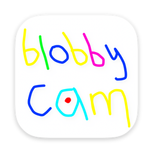
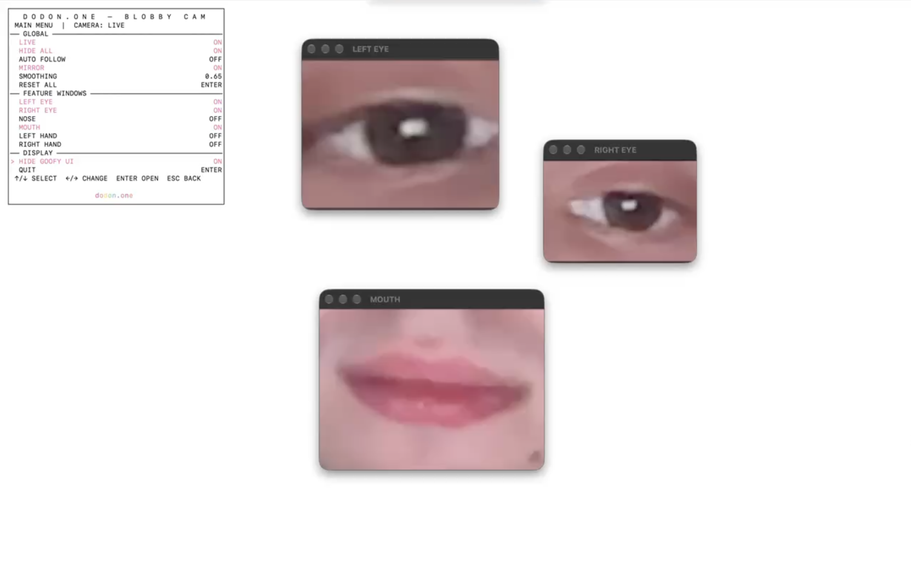

<div align="center">
  
  <h1>Blobby Cam</h1>
  <p><strong>A few windows. A lot of face.</strong></p>
  <p>Turn your webcam into a tiny desktop creature.<br>Or twenty mouths. That's your business.</p>
  <p><strong>Native macOS · Terminal controls · MIT · Local camera processing</strong></p>
  <p><a href="https://github.com/kirilldodon2-ux/blobby-cam/releases/tag/v0.1.0-preview.1">Download preview</a> · <a href="https://github.com/kirilldodon2-ux/blobby-cam/issues">Share a bug / odd idea</a></p>
  <p>Made by <a href="https://dodon.one">dodon.one</a></p>
</div>



## What is this thing?

Blobby Cam tracks your **eyes, nose, mouth, and hands** with Apple Vision and puts each live crop inside a real macOS window. Drag them around. Stretch them. Freeze one. Multiply another. Make something silly.

- **1–32 windows per feature.** New copies inherit the first window's settings; then each can have its own size, crop, position, and freeze.
- **Live video, steady placement.** Windows stay where you put them by default. AUTO FOLLOW is optional.
- **Crop your own way.** Zoom to a pupil, widen to an eyebrow, or pan the framing.
- **Terminal first.** Arrow keys, pink selection, rainbow LIVE. Optional **Goofy UI** for mouse controls.
- **Hide the chrome.** Remove titlebars globally or on one copy; drag the video and resize the edges.
- **No uploads or recording.** One camera pipeline, local tracking, shared Core Image / Metal rendering.

## Get the preview

**0.1.0 preview · Apple silicon · macOS 14+.** The current build is verified on an Apple silicon Mac running macOS 27; macOS 14 and Intel have not been tested. The prebuilt app needs **no Xcode**.

Download from the [0.1.0 preview release](https://github.com/kirilldodon2-ux/blobby-cam/releases/tag/v0.1.0-preview.1):

| Download | What you get |
|---|---|
| `BlobbyCam-macos-arm64-unsigned.zip` | App, double-click Terminal launcher, installer, licenses |
| Same filename + `.sha256` | Integrity checksum |

Unzip the package and double-click **Launch Blobby Cam.command**. Allow camera access when prompted; LIVE starts automatically. To install a downloaded ZIP instead:

```sh
sh install-preview.sh /path/to/BlobbyCam-macos-arm64-unsigned.zip
```

Keep the `.sha256` next to the ZIP. Installation creates `~/.local/bin/blobby-cam` and stores the app in `~/.local/share/blobby-cam`. It does not use sudo or change your shell profile. Launch later with:

```sh
~/.local/bin/blobby-cam
```

### One-command GitHub install

Run in your Terminal:

```sh
curl -fsSL https://raw.githubusercontent.com/kirilldodon2-ux/blobby-cam/v0.1.0-preview.1/scripts/install.sh | sh -s -- kirilldodon2-ux/blobby-cam
```

It downloads the **prebuilt** app, verifies SHA-256, installs, and opens the TUI. No build or Xcode download. The script reattaches input to your Terminal so arrow keys work even after `curl | sh`. To inspect it first, open [install.sh](scripts/install.sh), or download the ZIP manually.

For a previous installation, the installer stops rather than overwriting it. Quit Blobby Cam and move the existing `~/.local/share/blobby-cam/BlobbyCam.app` and `~/.local/bin/blobby-cam` aside before reinstalling.

**Unsigned preview:** macOS may block first launch. Review the downloaded app and use the normal **System Settings → Privacy & Security → Open Anyway** approval if you choose to run it. The installer does not disable Gatekeeper. A signed/notarized release is a future distribution step.

## Play with it

| Action | Result |
|---|---|
| ↑ / ↓ | Select a row |
| ← / → | Toggle or adjust |
| Enter on a feature | Open its window list |
| ← / → on WINDOWS | Add/remove copies (1–32) |
| Enter on a numbered window | Deep settings for that copy |
| ENABLED / FREEZE FRAME | Toggle that copy / hold its last crop |
| Esc | Go back |
| Drag titlebar; drag an edge | Move; resize |
| Drag video with HIDE UI BAR on | Move without a titlebar |
| Red close button | Remove that copy; closing the last one turns it OFF |
| QUIT / Ctrl-C | Exit and restore Terminal |

Default mood: **LIVE ON · MIRROR ON · AUTO FOLLOW OFF · AUTO CROP SCALE OFF · SMOOTHING 0**. Eye CROP ZOOM starts at **0.50×**. Window placement and crop framing are separate controls; changing one doesn't replace the other.

FREEZE FRAME holds one crop while the rest stay live. With LIVE OFF, frozen windows remain visible and ordinary windows hide. SHOW GOOFY UI opens the optional graphical menu.

## Make your walls weird

Try eyes on objects, a mouth on a sculpture, a face assembled across surfaces, or a whole choir of frozen mouths. Compose, mask, warp, and add effects in your projection software; use its output on a projector configured as an **extended display**.

### Experimental Syphon output

Blobby Cam can publish each enabled window copy as a separate video source, without titlebars or shadows:

1. Turn **SYPHON OUTPUT** ON in Terminal or Goofy UI (OFF by default).
2. In Ghost Arcade: **Media Library → SRC → Syphon In → Refresh**.
3. Select `Blobby / LEFT EYE / 1`, `Blobby / MOUTH / 1`, or another instance, and add it to a layer.
4. Arrange/effect/warp those layers in Ghost and send its output to the projector.

**Known issue:** sources have been reported to mix and flicker in Ghost Arcade. The official Metal client receives three simultaneous sources correctly in an automated test; the cause of the Ghost integration problem is unresolved. This is an experiment, not a verified show-ready output. It stays OFF unless you enable it.

Sources use stable instance serials. OFF/closing a copy removes its source; FREEZE holds its crop. HIDE ALL hides local windows while leaving output live. Output preserves each window's aspect-fill framing and is capped at 1024 pixels on its longest side. Connected receivers add GPU work; a sustained many-layer load test is still pending.

## Build your own

Source builds need full Xcode and its Metal Toolchain. No package manager or web runtime is involved. Download Apple's shader compiler once if it is missing:

```sh
xcodebuild -downloadComponent MetalToolchain
```

Then, from this repository:

```sh
./blobby-cam
```

Or double-click the repository's **Launch Blobby Cam.command**. This developer launcher builds before starting; the release launcher runs the prebuilt app directly.

```sh
xcodebuild -project BlobbyCam.xcodeproj -scheme BlobbyCam \
  -destination 'platform=macOS,arch=arm64' test
./scripts/package-preview.sh
```

Build caches live under `.build`; release archives go into `dist`. Neither is committed. The Apple compiler component (~839 MB in the tested Xcode) is not part of the app download. Package size is printed by the packaging script.

## Under the hood

`AVCaptureSession → CVPixelBuffer → Apple Vision → shared Core Image / Metal → persistent NSPanel windows`

Copies reuse one camera and the same tracking results. No per-frame JPEG/PNG/NSImage conversion, separate camera pipeline per feature, backend, or account system. The optional Syphon framework is bundled; its official source/version and BSD license are recorded in [Vendor/Syphon-PROVENANCE.md](Vendor/Syphon-PROVENANCE.md).

## Open project, odd ideas welcome

Blobby Cam is **MIT licensed** — use it, fork it, build a strange installation with it. Bundled Syphon remains under its own BSD license. See [LICENSE](LICENSE) and [Syphon license](Vendor/Syphon/License.txt).

When reporting a bug, include macOS/CPU, the control you used, and what you expected. Camera frames stay local; include face screenshots only if you want them public. See [QA notes](QA_NOTES.md) and [release review](RELEASE_REVIEW.md) for verification limits.
