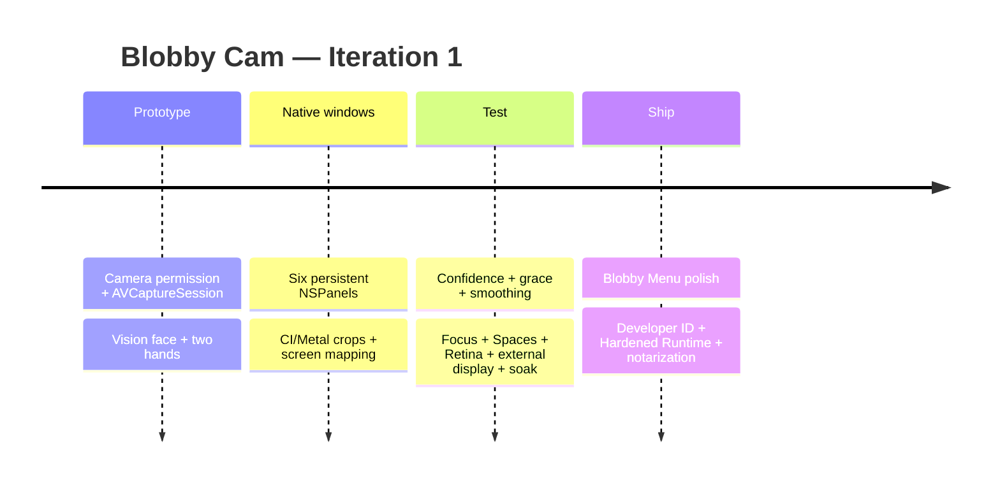

# Blobby Cam — native macOS research и Codex handoff

## Executive summary

Готов новый implementation brief именно под **нативный macOS-продукт**, где `LEFT EYE`, `RIGHT EYE`, `NOSE`, `MOUTH`, `LEFT HAND`, `RIGHT HAND` являются **шестью настоящими отдельными окнами macOS**, а не прямоугольниками внутри canvas.

Исходный файл `blobby-cam-native-macos-research.md` был частью первоначального handoff и не входит в этот репозиторий. Этот документ сохраняет его ключевые выводы.

Главная рекомендация для Iteration 1:

```text
AVCaptureSession
      ↓
CVPixelBuffer
      ├──────────────→ Apple Vision
      │                 ↓
      │          TrackingSnapshot
      │                 ↓
      └────→ shared CI / Metal renderer
                        ↓
                FeatureWindowManager
                  ↓ ↓ ↓ ↓ ↓ ↓
             six real NSPanels
```

Для камеры достаточно `AVCaptureSession` + `AVCaptureVideoDataOutput`; Apple требует serial callback queue для `AVCaptureVideoDataOutput`, а `alwaysDiscardsLateVideoFrames = true` позволяет отбрасывать устаревшие кадры вместо накопления очереди и роста памяти. citeturn15search10turn15search14

Для лица `VNDetectFaceLandmarksRequest` даёт `VNFaceLandmarks2D`, где уже существуют `leftEye`, `rightEye`, `nose`, `noseCrest`, `outerLips`, `innerLips`, pupils и другие области. Landmark-координаты нормализованы внутри `VNFaceObservation.boundingBox`, поэтому crop нужно сначала переводить в full-image coordinates. citeturn15search0turn15search1turn15search5turn15search6

Для рук используем `VNDetectHumanHandPoseRequest` с `maximumHandCount = 2`. `VNRecognizedPoint` содержит confidence, а `VNHumanHandPoseObservation` имеет `chirality`, то есть Vision умеет сообщать handedness — нам не нужно угадывать LEFT/RIGHT только по позиции руки на экране. citeturn13search8turn13search1turn13search17

Предыдущий browser-oriented research с React/MediaPipe/Canvas теперь **не является implementation architecture** для продукта. Из него имеет смысл сохранить только идею синхронизации кадра и tracking snapshot, если позже вернутся temporal delay/trails. fileciteturn0file0

Для **нынешнего v0 никакой frame ring вообще не нужен**: только webcam + live windows. Это заметно упрощает первую сборку.

## Архитектура, которую стоит дать Codex

### Capture

Минимальный pipeline:

```swift
AVCaptureDevice
    ↓
AVCaptureDeviceInput
    ↓
AVCaptureSession
    ↓
AVCaptureVideoDataOutput
    ↓
CMSampleBuffer
    ↓
CVPixelBuffer
```

`AVCaptureVideoDataOutputSampleBufferDelegate` уже предназначен для получения сырых video sample buffers. Callback надо держать коротким и отдавать Vision на отдельную serial queue; Apple прямо предупреждает, что если обработка не успевает за входными кадрами, очередь может привести к drop'ам или росту памяти. citeturn15search8turn15search10turn15search14

### Vision

На каждом анализируемом кадре:

```text
CVPixelBuffer
   ↓
VNSequenceRequestHandler

├── VNDetectFaceLandmarksRequest
│      ↓
│   leftEye
│   rightEye
│   nose
│   outerLips / innerLips
│
└── VNDetectHumanHandPoseRequest
       maximumHandCount = 2
       ↓
    chirality
    21 hand joints
    confidence
```

Apple предоставляет отдельный официальный sample **Detecting Hand Poses with Vision**, поэтому hand-point plumbing лучше адаптировать оттуда, а не писать по памяти. citeturn13search5turn13search8

Семантика feature model:

```swift
enum FeatureID: String, CaseIterable {
    case leftEye
    case rightEye
    case nose
    case mouth
    case leftHand
    case rightHand
}
```

Каждому feature нужны примерно:

```text
normalizedRect
confidence
timestamp
enabled
windowScale
cropPadding
detectionThreshold
```

### Rendering

Здесь найден самый важный shortcut.

**Не нужно делать шесть физически cropped `CVPixelBuffer` или `CGImage` на каждом кадре.**

Один camera `CVPixelBuffer` может быть источником для всех окон:

```text
             same CVPixelBuffer
                / / | \ \ \
               /  / |  \ \ \
             eye eye nose mouth hands
```

Для Iteration 1 я рекомендую:

```text
CVPixelBuffer
     ↓
CIImage(cvPixelBuffer:)
     ↓
six source crop rects
     ↓
ONE shared CIContext(MTLDevice)
     ↓
six small Metal-backed views
```

`CIImage` умеет создаваться непосредственно из `CVPixelBuffer`; для более низкоуровневого upgrade Apple предоставляет `CVMetalTextureCacheCreateTextureFromImage`, который создаёт Metal texture из Core Video image buffer. Apple отдельно описывает lifetime такого buffer/texture при GPU-работе. citeturn15search20turn15search4turn15search18

Поэтому схема:

**Core Image + Metal-backed context first → direct Metal only after profiling.**

Не надо начинать проект с собственного Metal shader engine.

`AVSampleBufferDisplayLayer` я бы **не использовал как основной renderer этих шести crop-окон**: он лучше подходит для отображения целых sample buffers. Кроме того, начиная с macOS 14 Apple discourages старый `AVSampleBufferDisplayLayer.enqueue(_:)` и направляет клиентов к `sampleBufferRenderer`. citeturn19search14turn19search0

`AVPlayerItemVideoOutput` оставлен в brief как future `FrameSource` для загруженных видео, но **в Iteration 1 его не реализуем**. Современный API даёт pixel-buffer frames в player-item timebase; это можно будет добавить, не меняя window architecture. citeturn19search2turn19search8

### Настоящие окна

Feature windows создаются **один раз** и затем только:

```text
show
hide
move
resize
change crop
```

а не уничтожаются и пересоздаются на каждом кадре.

Базовая конфигурация:

```swift
NSPanel(
    contentRect: rect,
    styleMask: [.borderless, .nonactivatingPanel],
    backing: .buffered,
    defer: false
)

panel.level = .floating
panel.isFloatingPanel = true
panel.becomesKeyOnlyIfNeeded = true

panel.isOpaque = false
panel.backgroundColor = .clear
panel.hidesOnDeactivate = false

panel.collectionBehavior = [
    .canJoinAllSpaces,
    .fullScreenAuxiliary
]
```

`NSPanel` специально является вспомогательным типом window и предоставляет `isFloatingPanel` и `becomesKeyOnlyIfNeeded`; `NSWindow` даёт прозрачность, mouse pass-through через `ignoresMouseEvents`, управление frame и прочее. citeturn16search0turn16search2

`canJoinAllSpaces` позволяет окну присутствовать во всех Spaces, а `fullScreenAuxiliary` — жить в одном Space с full-screen window. Для такого визуального инструмента это логичные defaults, хотя я бы оставил пользователю общий toggle. citeturn16search5turn16search4

## Приоритетные источники и готовые куски

В `.md` собраны **28 Apple docs / samples / GitHub references** с тем, что конкретно смотреть и какой license учитывать.

Самые ценные оказались не абстрактные demos, а несколько почти идеально совпадающих кирпичей.

| Priority | Reference | Что забрать | License |
|---|---|---|---|
| **P0** | `jkkronk/shoo` | `CameraController`, `HandFaceDetector`, Vision face+hands, smoothing/hysteresis | MIT |
| **P0** | Apple Vision hand sample | hand request + recognized points | Apple sample |
| **P0** | `selter2001/ActiveBackground` | AVFoundation → Vision → Metal architecture | MIT |
| **P0** | `JGL/TrackOSC` | macOS camera + Vision face/hand pipeline, orientation conventions | MIT |
| **P0** | `awens84/timer` | `.nonactivatingPanel`, `.floating`, AppKit/SwiftUI bridge | MIT |
| **P1** | `v2matosevic/WinHub` | native overlay/window behavior | MIT |
| **P1** | `selcukdinc/mirror-top` | transparent floating `NSPanel`, live layer rendering | README says MIT; verify before copying |
| **P2** | `VidCore.framework` | sample-buffer/pixel-pool ideas only | LGPL-2.1 |

Самый полезный repo — **Shoo**: это уже macOS camera-only приложение, которое делает `AVCaptureSession → CameraController → Apple Vision face landmarks + hand pose → smoothing/hysteresis`. Оно офлайн, sandboxed, camera-only и MIT. То есть considerable часть нашего non-visual tracking plumbing уже существует как хороший reference. citeturn21search1

`ActiveBackground` полезен другим куском: это native macOS приложение на SwiftUI/Metal/AVFoundation/Vision для realtime camera processing, то есть хороший reference для GPU-backed frame pipeline. citeturn14search3

`TrackOSC` уже запускает Apple Vision pipeline с камеры на macOS и поддерживает face/hand/body detection; проект MIT. Его стоит открыть ради orientation/coordinate handling и detector plumbing. citeturn14search0

`Boost Timer` полезен именно как маленький пример `NSPanel`: repo документирует `.nonactivatingPanel`, floating window level и `hidesOnDeactivate = false`; MIT. citeturn21search0

`WinHub` — ещё один MIT AppKit reference для native overlay/window behavior. citeturn13search14

`MirrorTop` особенно близок к нужному визуальному поведению: realtime content отображается внутри transparent floating `NSPanel`, а repo указывает `FloatingPanel.swift`, `CapturePreviewView.swift` и `StreamManager.swift`. Но README на момент исследования говорил MIT при ещё не добавленном LICENSE-файле, поэтому использовать его как **reference**, а не слепо копировать code chunks, пока license file не проверен. citeturn14search1

В Codex я бы открыл их именно так:

```text
1. shoo
2. Apple VNFaceLandmarks2D
3. Apple Detecting Hand Poses sample
4. Boost Timer / AppDelegate.swift
5. ActiveBackground rendering path
6. direct Metal docs — только если CI path реально тормозит
```

## Производительность и lifecycle

Для текущего scope не требуется хранить историю кадров.

Правильная модель:

```text
LatestFrameStore
├─ newest CVPixelBuffer
├─ timestamp
└─ newest TrackingSnapshot
```

Capture идёт дальше даже если Vision пропустил анализ очередного кадра. В realtime system лучше пропустить анализ, чем анализировать давно устаревшие кадры; это соответствует backpressure model, которую Apple описывает для `AVCaptureVideoDataOutput`. citeturn15search10turn15search14

Если позже вернутся наши старые `delay / echo / trails`, тогда уже:

```text
CVPixelBufferPool
       ↓
FrameRing

entry:
timestamp
app-owned CVPixelBuffer
TrackingSnapshot
```

`CVPixelBufferPool` предназначен для recyclable pixel buffers и позволяет избежать бесконтрольной новой аллокации каждого кадра. citeturn15search17turn15search19

Грубый planning budget для BGRA-equivalent:

```text
1280 × 720 × 4 bytes
≈ 3.52 MiB/frame

30 fps × 2 sec
≈ 211 MiB


640 × 360 × 4 bytes
≈ 0.88 MiB/frame

30 fps × 2 sec
≈ 52.7 MiB
```

Поэтому temporal history, если когда-нибудь понадобится, лучше держать reduced-resolution.

Для окон предлагаемый product budget:

```text
6   → основной продукт
12  → поддержать архитектурно / протестировать
16+ → experimental until profiled
```

Это **не ограничение macOS**, а намеренный performance budget: каждое из них является настоящим `NSWindow`, а не дешёвым sprite.

Lifecycle:

```text
HIDDEN
  ↓ confidence >= SHOW

VISIBLE
  ↓ temporary detection miss

GRACE
  ├─ detected again → VISIBLE
  └─ timeout → fade → HIDDEN
```

Начальные значения:

```text
Show threshold      0.55
Hold threshold      0.40
Grace               250 ms
Hide fade           120 ms
EMA smoothing       0.30
Crop padding        25%
Window size         0.25× – 4×
```

Это tuning defaults, а не значения, предписанные Apple.

Confidence для hand regions можно строить из confidence отдельных recognized joints, потому что `VNRecognizedPoint` предоставляет confidence. Hand identity можно брать из `chirality`. citeturn13search1turn13search17

У face features отдельного confidence для каждой точки вроде «левый глаз = 0.81» нет в используемом face-landmark representation, поэтому `DETECT` для face regions разумно основывать на face observation confidence + геометрической валидности + hysteresis, а не изображать несуществующую «уверенность носа». `VNFaceLandmarks2D` предоставляет геометрию feature regions. citeturn15search6

## Codex structure и acceptance gate

Предложенная структура в готовом brief:

```text
BlobbyCam/
├─ App/
│  ├─ AppDelegate.swift
│  └─ AppState.swift
│
├─ Camera/
│  ├─ CameraCapture.swift
│  ├─ CameraPermission.swift
│  └─ LatestFrameStore.swift
│
├─ Vision/
│  ├─ VisionTracker.swift
│  ├─ FaceRegionExtractor.swift
│  ├─ HandRegionExtractor.swift
│  ├─ TrackingSnapshot.swift
│  └─ TrackingSmoother.swift
│
├─ Windows/
│  ├─ FeatureWindowManager.swift
│  ├─ FeaturePanel.swift
│  ├─ FeatureRenderView.swift
│  └─ ScreenMapper.swift
│
├─ Rendering/
│  ├─ SharedRenderer.swift
│  ├─ CoreImageCropRenderer.swift
│  └─ MetalCropRenderer.swift
│
├─ Menu/
│  ├─ BlobbyMenuView.swift
│  ├─ FeatureControlRow.swift
│  └─ BlobbyTheme.swift
│
├─ Resources/
│  ├─ Assets.xcassets
│  └─ BlobbyCam.entitlements
│
└─ BlobbyCamTests/
```

**Runtime SPM dependencies: zero.**

Только:

```text
AppKit
SwiftUI          // control menu only
AVFoundation
Vision
CoreVideo
CoreImage
Metal
MetalKit
QuartzCore
```

Acceptance gate в `.md` специально запрещает Codex начинать «улучшения», пока не выполнено:

```text
✓ camera permission allow / deny
✓ webcam start / stop / reconnect

✓ LEFT EYE
✓ RIGHT EYE
✓ NOSE
✓ MOUTH
✓ LEFT HAND
✓ RIGHT HAND

✓ six persistent real NSPanels
✓ correct semantic left/right hands
✓ mirror mode doesn't double-flip coordinates
✓ confidence + grace prevents flicker

✓ Size works per feature
✓ Crop works per feature
✓ Detect works per feature

✓ feature windows don't steal keyboard focus
✓ Retina mapping works
✓ external-display mapping works

✓ no JPEG/PNG/NSImage conversion every frame
✓ no six-way pixel-buffer copies
✓ 10-minute run reaches memory plateau
```

И отдельно:

```text
× React
× WebView
× Electron
× Tauri
× upload video
× recording
× timeline
× echoes/trails
× hair segmentation
```

для первой итерации.

## Permissions и shipping

Перед capture нужно проверить `AVCaptureDevice.authorizationStatus(for: .video)` и при `.notDetermined` вызвать `requestAccess(for: .video)`. Apple требует `NSCameraUsageDescription` для camera access. citeturn18search0turn18search7

В brief заложено:

```xml
<key>NSCameraUsageDescription</key>
<string>Blobby Cam uses your camera locally to turn your eyes, nose, mouth, and hands into live macOS windows.</string>
```

Для sandboxed build:

```xml
<key>com.apple.security.app-sandbox</key>
<true/>

<key>com.apple.security.device.camera</key>
<true/>
```

Apple документирует camera entitlement как `com.apple.security.device.camera`. Для Mac App Store App Sandbox обязателен; для Developer ID distribution вне App Store sandbox может быть optional, но Hardened Runtime нужен для notarization. citeturn18search3turn17search0

Я рекомендовал **macOS 14+** как product deployment target, а не как утверждение о самом раннем возможном API floor. Это позволяет не тратить первую итерацию на compatibility branches; найденные близкие native references Shoo и Boost Timer тоже ориентированы на macOS 14+. citeturn21search1turn21search0

Для нормального `.dmg/.app` вне Mac App Store pipeline стандартный:

```text
Developer ID Application
        ↓
Hardened Runtime
        ↓
archive
        ↓
notarytool / Xcode notarization
        ↓
staple / package
```

Apple рекомендует Developer ID для software вне Mac App Store и предоставляет `notarytool` для notarization workflow. citeturn17search1turn17search2

## Blobby Menu и готовый artifact

UI в research намеренно урезан до **одного маленького control window**, а не camera-editor screen:

```text
┌ BLOBBY CAM          CAM LIVE ┐
│ [ LIVE ]             [RESET] │
│                              │
│ LEFT EYE               [ON]  │
│ SIZE     ━━━━━●━━            │
│ CROP     ━━━●━━━━            │
│ DETECT   ━━━━━●━━            │
│                              │
│ RIGHT EYE ...                │
│ NOSE ...                     │
│ MOUTH ...                    │
│ LEFT HAND ...                │
│ RIGHT HAND ...               │
│                              │
│ FOLLOW   ━━━━━●━━            │
│ MIRROR              [ON/OFF] │
└──────────────────────────────┘
```

Зафиксированы твои design tokens:

| token | value |
|---|---|
| base | `#7A17E0` |
| base-deep | `#4E0FA0` |
| accent | `#FF70B8` |
| accent-soft | `#FFA6D3` |
| ink | `#111113` |
| paper | `#F4F2EA` |
| border | `2 pt solid ink` |
| radius | `16 pt` |
| shadow | `3 pt right / 4 pt down / blur 0` |
| min hit target | `48–52 pt` |

Logo отдельно определён как **маленький black/white/pink bobble/blob mascot**: один глаз или camera-lens face, толстый простой outline, никаких gradients/glow/glossy 3D.



**Исходный Codex-ready файл:** `blobby-cam-native-macos-research.md` (не входит в репозиторий).
